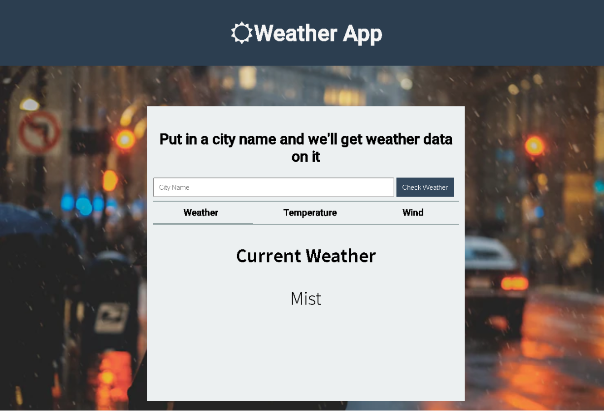
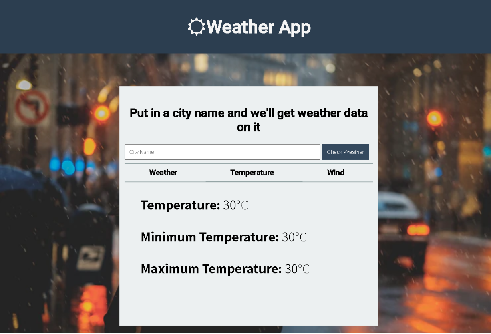
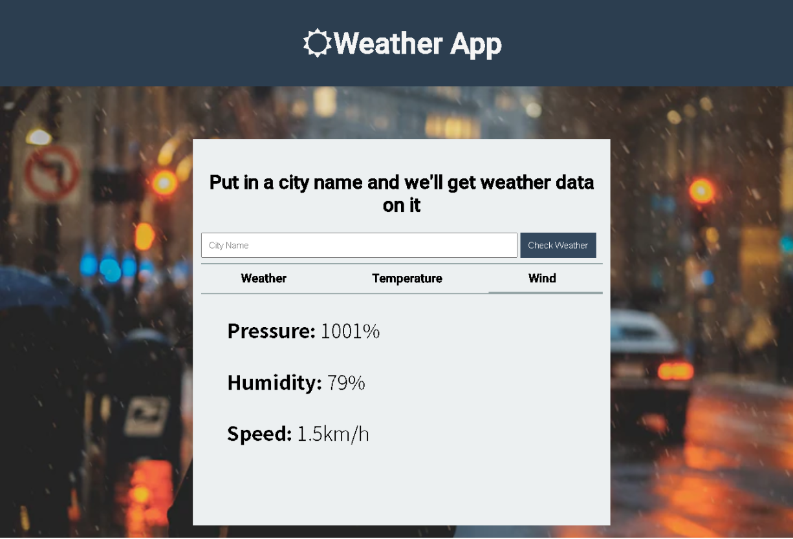

# Flask Weather App

This is a web app which shows the weather data of a specific inputted city

It is made with:-
* HTML
* CSS
* Vanilla Javascript
* Flask (Python)

When inputted with a city name,
it will show the following data

* Weather

* Temperatures

* Wind

__Note__: If you are going to try out this app then remember that i have removed the API key. So you have to get your own API key from openweathermap